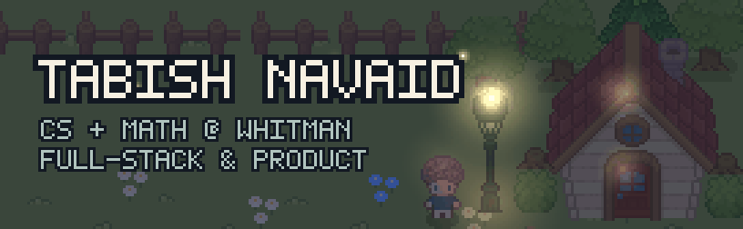
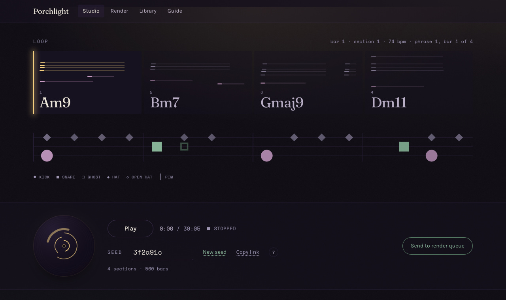
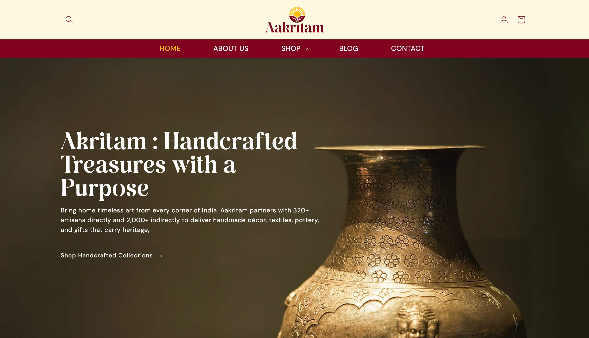
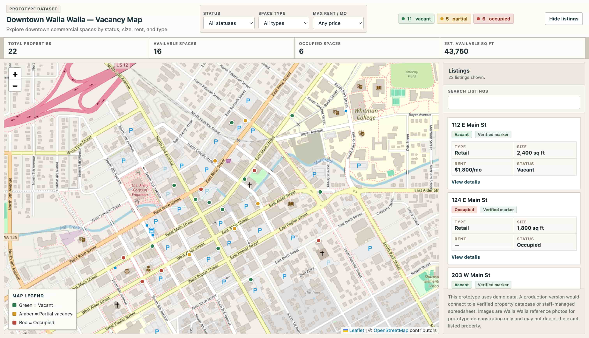
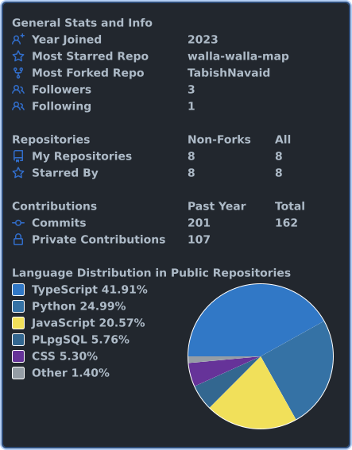
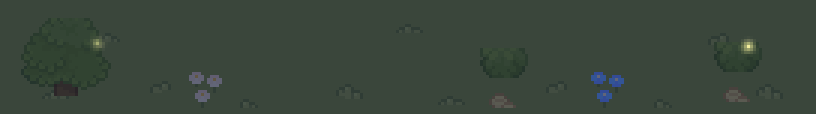

<!--
  github.com/TabishNavaid  ->  renders on the profile page.
  Fill AAKRITAM_URL, MAP_URL and PONDHOPPER_URL before pushing.
-->

CS and math at Whitman College, class of 2028. I build web apps and small games. Last summer I interned at Movate.

**Right now**

- **Willow Hollow**, a farming and town sim in Godot. I am on map generation and the save system. There is a checker that walks every generated map and flags tiles you cannot reach.
- **firstseen**, an agent that scrapes job boards and predicts when internships will open. It gives you two dates: have your resume ready by the first, have a referral by the second.
- Front-end and accessibility on Whitman's website. Compliance went from 70% to 99.6% across a thousand-odd pages.

## Things I have shipped

<table>
<tr>
<td width="33%" valign="top">

<b><a href="https://github.com/TabishNavaid/porchlight">Porchlight</a></b> 
A lofi generator that runs in your browser. Fourteen style packs, seeded output, WAV export. No server, no samples.
</td>
<td width="33%" valign="top">

<b><a href="AAKRITAM_URL">Aakritam</a></b> 
A storefront I built for a fair-trade marketplace. 320+ artisans, five product categories, live and taking orders.
</td>
<td width="33%" valign="top">

<b><a href="MAP_URL">Downtown Vacancy Map</a></b> 
Built with the Downtown Walla Walla Foundation and Whitman's economics department. Leaflet, GeoJSON, Overpass.
</td>
</tr>
</table>

Also [Bloom](https://github.com/TabishNavaid/bloom), a to-do app shaped like a garden. [Pond Hopper](PONDHOPPER_URL), a browser game with ghost replays and a daily challenge. [SOS](https://github.com/TabishNavaid/SOS---Save-Our-Souls), a lost-and-found app that won the Walla Walla hackathon out of ten teams. We built it in twelve hours.

## Stack

<table>
<tr>
<td width="52%" valign="top">

**Languages** TypeScript, JavaScript, Python, C#, SQL, GDScript 
**Web** React, Node, Supabase, Postgres, Tailwind, Leaflet, Web Audio 
**Games** Godot 
**Tools** Git, Docker, Linux, AWS, Vercel, Cloudflare, axe

**Elsewhere** 
[tabishnavaid.dev](https://tabishnavaid.dev) 
[hello@tabishnavaid.dev](mailto:hello@tabishnavaid.dev) 
[LinkedIn](https://www.linkedin.com/in/tabish-navaid/)

</td>
<td width="48%" valign="top">

</td>
</tr>
</table>

Banner and avatar composed by me from <a href="https://shubibubi.itch.io/">shubibubi's</a> Cozy Farm and Character v.2 packs.
